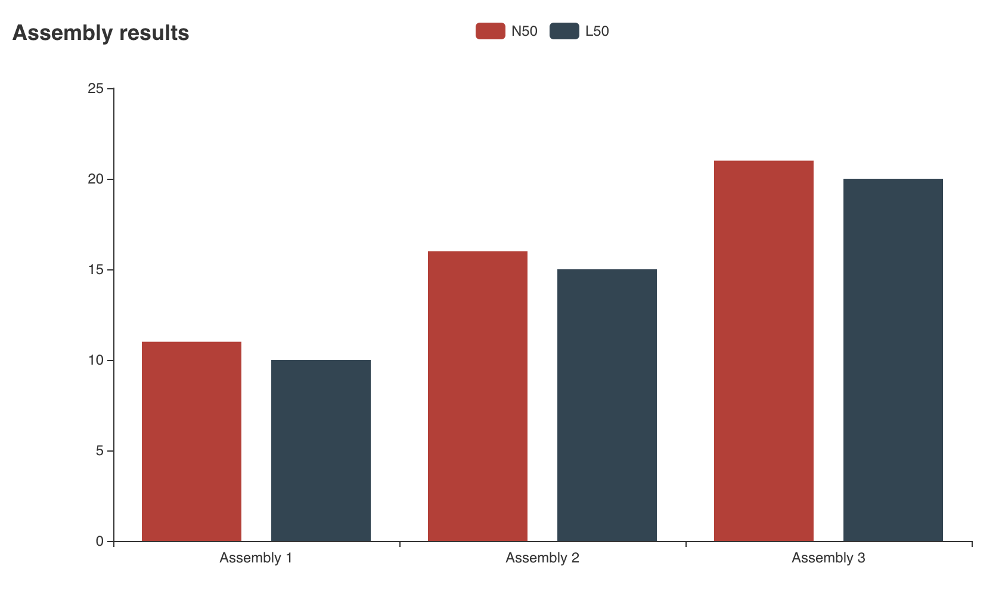

<div align="center">
    <h1>GenoAssist</h1>
    <br /><i>An all-encompassing bioinformatics tool for genome assembly and annotation projects</i><br>
</div>

---

# Table of contents

1. [About](#1-about) </br>
1. [Installation](#2-installation)
1. [GenoAssist Usage](#3-genoassist-usage)
1. [Architecture](#4-architecture)
1. [Maintainers](#5-maintainers)
1. [Feedback and bug reports](#6-feedback-and-bug-reports)

## 1. About

One of the challenges that computational biologists face during genome assembly projects is choosing 
from the plethora of assembly software. This is highly time-consuming as there are various parameters for each of the 
assemblers that the user needs to learn about. In addition, even if users learn about the various parameters of each 
assembler, various assemblers still need to be run, and statistical results need to be compared to identify the best 
assembly. GenoAssist helps computational biologists by centralizing all the assemblers, their parameters, running 
environments, and results reporting in a single place. 
 
## 2. Installation

1. You can either use go (will be added to `$GOPATH/`):
    ```sh
    $ go get -u github.com/genoassist/genoassist
    ```
    
    Or clone the repository:  
    ```sh
    $ git clone https://github.com/genoassist/genoassist
    ```
1. Build the `main.go` file
    ```sh
    $ go build main.go
    ```

If you are missing packages, run `go mod vendor` to collect the necessary packages

## 3. GenoAssist usage

GenoAssist only requires a YAML file that contains the configuration it should use to run its processes. A template can 
be found in this repository. For convenience, here's an example specification:

```yaml
assemblers:
  megahit:
    kmers: "27"
  abyss:
    kmers: "27"
genoassist:
  assemblers: ['abyss','megahit','flye']
  inputFilePath: "/test/raw_sequences.fastq"
  outputPath: "/test/output"
  threads: 2
  prep: true
  qualityControl: true
```
Notes: 
 - all paths used with GenoAssist have to be absolute paths (a Docker requirement)
 - the accepted assembler values are:
1. 'abyss'
1. 'megahit'
1. 'flye'

### Installing Docker images through GenoAssist

If you are encountering problems with Docker, make sure that:
1. The Docker daemon is running in the background
1. You have the necessary Docker images, which can be installed via GenoAssist specifying `prep: true` under `genoassist`
in the YAML configuration. This will install the necessary Docker images for the containers that GenoAssist 
runs.

### Sample assembly result visualization



## 4. Architecture

The overall model follows the primary/replica architecture. The primary is what users interact with. 
The users specify the files containing the contigs and what type of read they have e.g Illumina. 
The primary takes the user's input and schedules assembly, parsing of results, and reporting, in that order. 


## 5. Maintainers

[Tayab Soomro](https://github.com/tayabsoomro)  
[Flaviu Vadan](https://github.com/flaviuvadan)

Feel free to contact any of the maintainers if you would like to be an active 
maintainer and contributor to GenoAssist! If you would like to contribute only,
you are encouraged to grab an issue and submit a pull request with proposed
changes for review! 

## 6. Feedback and bug reports

Submit feedback and bug reports by using the Issues section of the repository.

