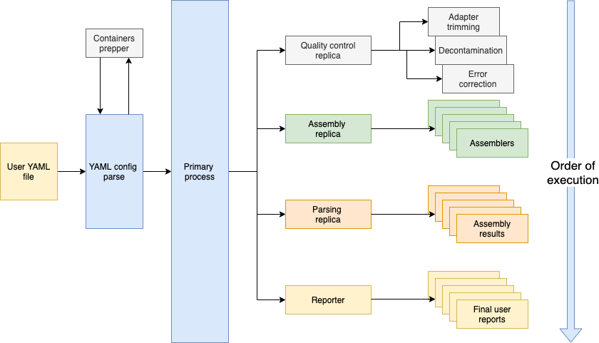

<p style="align-content: center">
    
    <br /><i>An all-encompassing Bioinformatics tool for genome assembly and annotation projects</i><br>
</p>

---

# Table of contents

1. [About](#1-about) </br>
1. [Installation](#2-installation)
1. [GenoMagic Usage](#3-genomagic-usage)
1. [Architecture](#4-architecture)
1. [Feedback and bug reports](#5-feedback-and-bug-reports)

## 1. About

An all-encompassing Bioinformatics tool for genome assembly and annotation projects. 
This project is still under development.
 
## 2. Installation

1. You can either use go (will be added to `$GOPATH/`):
    ```sh
    $ go get -u github.com/genomagic
    ```
    
    Or clone the repository:  
    ```sh
    $ git clone https://github.com/genomagic/genomagic
    ```
2. Build the `main.go` file
    ```sh
    $ go build main.go
    ```

If you are missing packages, run `go mod vendor` to collect the necessary packages

## 3. GenoMagic usage
The available flags are:
 
<table>
    <tr>
        <th>Flag</th>
        <th>Value</th>
        <th>Required</th>
        <th>Description</th>
    </tr>
    <tr>
        <td><code>fastq</code></td>
        <td>./path/to/sequence.fastq</td>
        <td>Yes</td>
        <td>The path to the FASTQ file containing raw sequence data for assembly</td>
    </tr>
    <tr>
        <td><code>prep</code></td>
        <td><code>true</code> / <code>false</code></td>
        <td>No</td>
        <td>whether to install all the necessary Docker containers for assembly as a preparatory step. 
            Should be done at least once</td>
    </tr>
    <tr>
        <td><code>out</code></td>
        <td>./path/to/output/directory</td>
        <td>No</td>
        <td>The path to the directory where results will be stored, defaults to current working directory</td>
    </tr>
    <tr>
        <td><code>threads</code></td>
        <td><code>integer</code></td>
        <td>No</td>
        <td>The number of threads to use for assembly and output parsing processes</td>
    </tr>
</table>

Note: all pahts used with GenoMagic have to be absolute paths (a Docker requirement).

### Simple usage
If you simply want to perform assembly and allow GenoMagic to use its default parameters, use:
```
$ ./main -fastq=/path/to/reads.fastq
```

### Installing Docker images through GenoMagic
If you are encountering problems with Docker, make sure that:
1. The Docker daemon is running in the background
1. You have the necessary Docker images, which can be installed via GenoMagic by using:
```
$ ./main -prep=true -fastq=/path/to/reads.fastq
```
This will pull the necessary Docker images for the assemblers that GenoMagic runs.

### Specifying your own output directory
GenoMagic assumes the current working directory as the output directory, but it can also drop its output into a 
different directory:
```
$ ./main -fastq=/path/to/reads.fastq -out=/path/to/output/directory
``` 

## 4. Architecture

The overall model follows the master/slave architecture. The master is what users interact with. 
The users specify the files containing the contigs and what type of read they have e.g Illumina. 
The master takes the user's input and schedules assembly, parsing of results, and reporting, in that order. 



## 5. Feedback and bug reports
Submit feedback and bug reports by using the Issues section of the repository.

